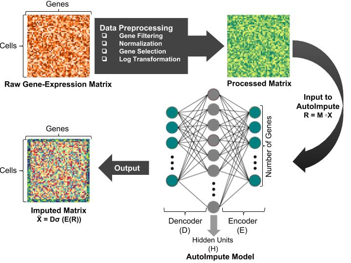

AutoImpute: Autoencoder based imputation of single cell RNA-seq data
================
Divyanshu Talwar, Aanchal Mongia, Debarka Sengupta, and Angshul Majumdar

## Introduction
`AutoImpute` is an auto-encoder based gene-expression (sparse) matrix imputation.

For detailed information refer to our paper titled "[AutoImpute : Autoencoder based imputation of single cell RNA-seq data](https://www.nature.com/articles/s41598-018-34688-x)".

-	For technical problems, please report to [Issues](https://github.com/divyanshu-talwar/AutoImpute/issues).

## Description
The input to `AutoImpute.py` is a pre-processed count single cell matrix, with columns representing genes and rows representing cells. It's output is an imputed count matrix with the same dimension. The complete pipeline is described with the following image : 

.

## Dependencies
* For Python (2.7):
    > numpy, scikit-learn, tensorflow, matplotlib.
* For R (pre-processing):
	> R.matlab, Matrix, ggplot2, Rtsne, svd, plyr, dplyr, data.table, mclust, flexclust, reshape2, irlba, dynamicTreeCut, RColorBrewer, GenSA, gplots

## Contents
* `AutoImpute\ Model/AutoImpute.py` - is the AutoImpute imputation model.
* `AutoImpute\ Model/data/raw` - contains the raw data in `.csv` format.
* `AutoImpute\ Model/data/` - contains the pre-processed data in `<dataset_name>.{mat, csv}` format.
* `AutoImpute\ Model/Pre-processing/` - contains the R scripts for pre-processing.

## Execution
* To run the `AutoImpute` model, first change your directory to `AutoImpute\ Model` using the following command :
	* `cd AutoImpute\ Model`
* `AutoImpute` model can be run using the following command and command line arguments :
```bash
python AutoImpute.py
```
```
Options :
		--debug True	# To print and save debug statements (loss function value)
		--debug_display_step 1	# Number of steps to display loss function value after
		--hidden_units 2000	# Size of hidden layer or latent space dimensions.
		--lambda_val 1	# Regularization coefficient, to control the contribution of regularization term in the cost function.
		--initial_learning_rate 0.0001	# Initial value of learning rate.
		--iterations 7000	# Number of iterations to train the model for.
		--threshold 0.0001	# To stop gradient descent after the change in loss function value in consecutive iterations is less than the threshold, implying convergence.
		--data blakeley.csv 	# Dataset to run the script on.
		--masked_matrix_test False	# Run the masked matrix recovery test?
		--masking_percentage 10	# Percentage of masking required. Like 10, 20, 12.5 etc.
		--save_model_location checkpoints/model1.ckpt 	# Location to save the learnt model.
		--load_model_location checkpoints/model0.ckpt 	# Load the saved model from.
		--log_file log.txt 	# text file to save training logs.
		--load_saved False # flag to indicate if a saved model will be loaded.
		--imputed_save imputed_matrix 	# Save the imputed matrix as
		--masked_save masked_matrix 	# Save the masked matrix as

```
_**Note:** If you use any other dataset (apart from blakeley.csv), do the necessary preprocessing using as described below, then run AutoImpute as `python AutoImpute.py --data <dataset_name>.{mat, csv}`._

* To pre-process any dataset, place the raw data (in `.csv` format) into `AutoImpute\ Model/data/raw/` and change your directory to `AutoImpute\ Model/Pre-processing/`.
* Run the R-script `pre-process.R` using the following command:
```bash
Rscript pre-process.R <input-file-name> <dataset-name>
```
* For example, the sample dataset can be pre-processed using the following command:
```bash
Rscript pre-process.R Blakeley_raw_data.csv blakeley
```
## How to cite
```
@article{talwar2018autoimpute,
  title={AutoImpute: Autoencoder based imputation of single-cell RNA-seq data},
  author={Talwar, Divyanshu and Mongia, Aanchal and Sengupta, Debarka and Majumdar, Angshul},
  journal={Scientific Reports},
  volume={8},
  number={1},
  pages={16329},
  year={2018},
  publisher={Nature Publishing Group}
}
```
